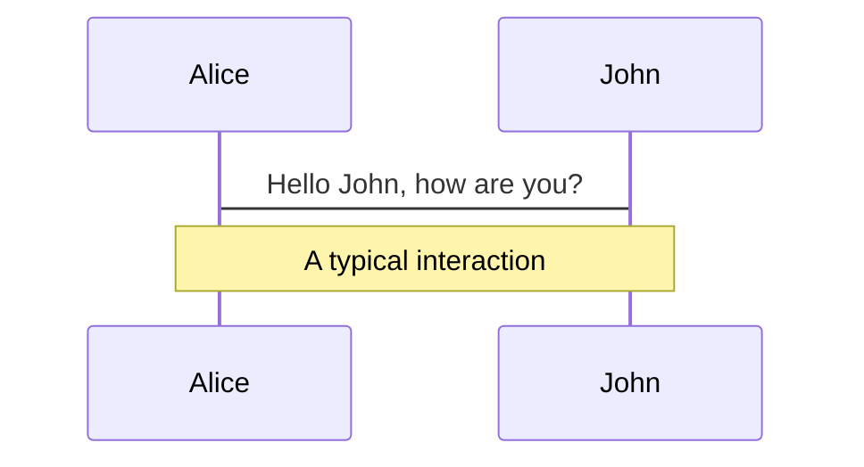
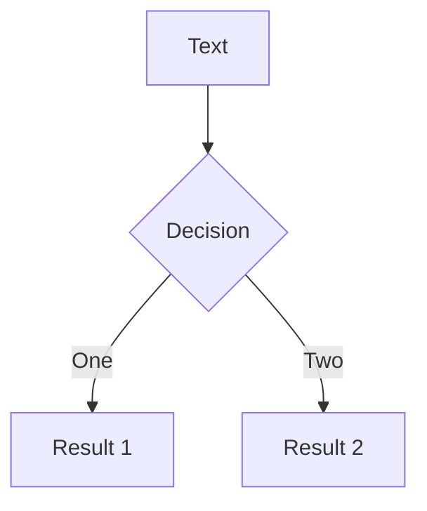

Title: Slidev

URL Source: http://sli.dev/features/mermaid

Markdown Content:
Mermaid Diagrams | Slidev

===============

[Skip to content](http://sli.dev/features/mermaid#VPContent)

[Slidev[New Docs!](http://sli.dev/features/mermaid)](http://sli.dev/)

Search

 Main Navigation 

📖 Guide

[Why Slidev](http://sli.dev/guide/why)

[Getting Started](http://sli.dev/guide/)

[Syntax Guide](http://sli.dev/guide/syntax)

[User Interface](http://sli.dev/guide/ui)

[Animations](http://sli.dev/guide/animations)

[Theme & Addons](http://sli.dev/guide/theme-addon)

[Components](http://sli.dev/guide/component)

[Layouts](http://sli.dev/guide/layout)

[Exporting](http://sli.dev/guide/exporting)

[Hosting](http://sli.dev/guide/hosting)

[FAQ](http://sli.dev/guide/faq)

Advanced

[Global Context](http://sli.dev/guide/global-context)

[Writing Layouts](http://sli.dev/guide/write-layout)

[Writing Themes](http://sli.dev/guide/write-theme)

[Writing Addons](http://sli.dev/guide/write-addon)

[✨ Features](http://sli.dev/features/)

Reference

Built-in

[CLI](http://sli.dev/builtin/cli)

[Components](http://sli.dev/builtin/components)

[Layouts](http://sli.dev/builtin/layouts)

Customize

[Configurations](http://sli.dev/custom/)

[Directory Structure](http://sli.dev/custom/directory-structure)

[Configure Highlighter](http://sli.dev/custom/config-highlighter)

[Configure Vite and Plugins](http://sli.dev/custom/config-vite)

[Configure Vue App](http://sli.dev/custom/config-vue)

[Configure UnoCSS](http://sli.dev/custom/config-unocss)

[Configure Code Runners](http://sli.dev/custom/config-code-runners)

[Configure Transformers](http://sli.dev/custom/config-transformers)

[Configure Monaco](http://sli.dev/custom/config-monaco)

[Configure KaTeX](http://sli.dev/custom/config-katex)

[Configure Mermaid](http://sli.dev/custom/config-mermaid)

[Configure Routes](http://sli.dev/custom/config-routes)

[Configure Shortcuts](http://sli.dev/custom/config-shortcuts)

[Configure Context Menu](http://sli.dev/custom/config-context-menu)

[Configure Fonts](http://sli.dev/custom/config-fonts)

[Configure Pre-Parser](http://sli.dev/custom/config-parser)

Resources

[Showcases](http://sli.dev/resources/showcases)

[Theme Gallery](http://sli.dev/resources/theme-gallery)

[Addon Gallery](http://sli.dev/resources/addon-gallery)

[Learning Resources](http://sli.dev/resources/learning)

[Curated Covers](http://sli.dev/resources/covers)

[Release Notes](https://github.com/slidevjs/slidev/releases)

English (v52.10.1)

[简体中文](https://cn.sli.dev/features/mermaid)

[日本語](https://ja.sli.dev/features/mermaid)

[](https://github.com/slidevjs/slidev)[](https://twitter.com/slidevjs)[](https://chat.sli.dev/)

English (v52.10.1)

[简体中文](https://cn.sli.dev/features/mermaid)

[日本語](https://ja.sli.dev/features/mermaid)

Appearance

[](https://github.com/slidevjs/slidev)[](https://twitter.com/slidevjs)[](https://chat.sli.dev/)

Menu

Return to top

 Sidebar Navigation 

Back to
-------

[All Features](http://sli.dev/features)

Related to
----------

[Mermaid](https://mermaid.js.org/)

[Mermaid Live Editor](https://mermaid.live/)

[Demo Slide](https://sli.dev/demo/starter/12)

[✨ PlantUML Diagrams](http://sli.dev/features/plantuml)

 Tags 

[Diagram](http://sli.dev/features/#tags=diagram)

On this page

Are you an LLM? You can read better optimized documentation at /features/mermaid.md for this page in Markdown format

Mermaid Diagrams [​](http://sli.dev/features/mermaid#mermaid-diagrams)
======================================================================

You can also create diagrams/graphs from textual descriptions in your Markdown, powered by [Mermaid](https://mermaid.js.org/).

Code blocks marked as `mermaid` will be converted to diagrams, for example:

md
```

```

You can further pass an options object to it to specify the scaling and theming. The syntax of the object is a JavaScript object literal, you will need to add quotes (`'`) for strings and use comma (`,`) between keys.

md
```

```

Visit the [Mermaid Website](https://mermaid.js.org/) for more information.

[Suggest changes to this page](https://github.com/slidevjs/slidev/edit/main/docs/features/mermaid.md)

Pager

[Next page All Features](http://sli.dev/features)

Released under the MIT License.

Copyright © 2020-2025 Anthony Fu.

